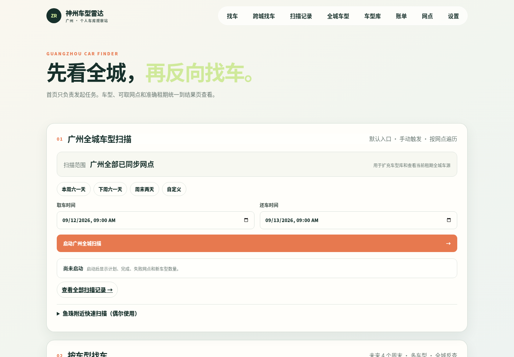

<div align="center">

# Zuche Model Radar

**Scan the city first. Then find the car you want.**

Self-hosted rental car model tracker for discovering vehicle models, rental locations, availability windows, and price changes from Shenzhou Car Rental's public mobile responses.

English | [简体中文](README.zh-CN.md)

[](https://www.python.org/)
[](https://fastapi.tiangolo.com/)
[](https://www.postgresql.org/)
[](https://docs.docker.com/compose/)
[](LICENSE)

</div>



## What it does

| Capability | Description |
| --- | --- |
| City-wide model scan | Walk through synchronized rental locations for a defined rental period and summarize models, pickup locations, and price differences |
| Permanent model library | Keep every discovered model without automatic deletion while updating labels and last-seen timestamps |
| Search by model | Select interesting vehicles from the library and search future weekends for matching periods and pickup locations |
| Cross-city search | Compare one exact vehicle variant across multiple pickup cities and rental windows |
| History and export | Store scan status, failures, changes, and normalized results with CSV export |
| Map cache | Optionally use Baidu Maps place search and cache the latest valid response locally |
| AI enrichment | Optionally use an OpenAI-compatible endpoint to classify vehicle energy types one model at a time |

The current workflow is centered on Guangzhou, while the city, location, and task models leave room for broader regional coverage.

## Quick start

Docker and Docker Compose are required.

```bash
git clone https://github.com/LuckinSven/8093-zuche-radar-public.git
cd 8093-zuche-radar-public
cp .env.example .env
```

Edit `.env` and set at least a strong, local-only database password:

```dotenv
POSTGRES_PASSWORD=replace-with-a-random-password
```

Start the service:

```bash
docker compose up -d --build
docker compose ps
curl -fsS http://127.0.0.1:8093/healthz
```

Open `http://YOUR-LAN-SERVER-IP:8093`. A healthy application returns:

```json
{"service":"zuche-radar","status":"ok","database":"ok"}
```

## Suggested workflow

1. Synchronize Shenzhou's public city catalog and the target city's rental locations in **Settings**.
2. Select pickup and return times on the home page, then manually start a city-wide model scan.
3. Review completeness in **Scan History** and inspect period-specific results in **City-wide Models**.
4. Tag interesting vehicles and use **Search by Model** to look for future availability.
5. Configure Baidu Maps or an OpenAI-compatible service only when map search or model enrichment is needed.

## Data semantics

- **Available** means at least one real pickup location was returned for the current query.
- **Not found** is only valid after every relevant sample finishes successfully without a match.
- Running, stopped, interrupted, or partially failed work is reported as **Incomplete**.
- Displayed prices come from upstream listing fields and are not final checkout prices.
- Raw responses and detailed offers are retained for 60 days by default; the model library is retained long term.
- The application does not store Shenzhou account credentials, cookies, or authenticated sessions.

<details>
<summary><strong>Scan states, sampling, and retention</strong></summary>

- City-wide scans use `AVAILABLE`, `NOT_FOUND`, and `INCOMPLETE` to preserve result trust.
- Detailed location offers and compressed raw responses are retained for 60 days; task summaries and the permanent model library remain available.
- Search-by-model tasks sample the next four weekends, starting with 24- and 48-hour Saturday rentals before checking hourly windows at candidate locations.
- A successful request for the same model, location, and exact rental window may be reused for two hours. Estimated work above 2,000 requests reduces concurrency; work above 5,000 requests is rejected.
- The first implementation uses same-city returns in Guangzhou. Search tasks, samples, and offers are retained for 60 days.
- Final inventory, price, return eligibility, and fees must always be confirmed on the official booking page.

</details>

## Optional integrations

Baidu Maps and AI enrichment are optional. API keys are entered through the local settings page and stored in PostgreSQL; read endpoints only expose a masked state. Never place real keys in source code, `.env.example`, screenshots, or public issues.

AI enrichment supports OpenAI-compatible `/chat/completions` endpoints and processes one model per request. Map search prioritizes the permanent local cache to reduce third-party quota usage.

<details>
<summary><strong>AI enrichment and recovery</strong></summary>

- The pending-only action processes unknown, low-confidence, or incomplete models. Reprocessing every model is intended for model-provider changes or a full review.
- Tasks can be stopped, resumed, and retried. Only high-confidence, internally consistent classifications are applied; unknown results are never guessed.
- Task history records processed models, failures, requests, and token usage. Clearing the API key also disables enrichment.
- After a Docker restart, waiting or running tasks become interrupted and require a manual resume, preventing unexpected quota usage.

</details>

## Technology

- FastAPI, Jinja2, and vanilla JavaScript
- PostgreSQL 16, SQLAlchemy, and Alembic
- APScheduler background jobs
- Docker Compose deployment
- Pytest regression suite

## Development and tests

```bash
python3.12 -m venv .venv
.venv/bin/pip install -e '.[dev]'
.venv/bin/pytest -q
```

Development tests must use a database separate from production. Never run schema-resetting tests against production data.

## Security boundary

This project currently has no user authentication, authorization, rate limiting, or public-network hardening. It is intended for a trusted LAN and personal environments. Do not expose the application port directly to the internet.

Database backups may contain business data and third-party API keys and must be stored outside the repository. See [SECURITY.md](SECURITY.md) for details.

## Disclaimer

This is an independent personal research project and is not affiliated with, endorsed by, or operated by Shenzhou Car Rental, Baidu Maps, or any other third-party service. Users are responsible for complying with applicable terms, rate limits, and laws. Always confirm vehicle details, inventory, price, pickup and return eligibility, and fees through the official booking channel.

## License

[MIT License](LICENSE) © 2026 LuckinSven
